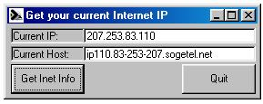



## Get your Internet IP address even behind firewall \*Updated 02\-10\-2002\*

### Description

This code allows you to get your ip and host from a web page. This also works when you are behind a firewall or proxy. This code was only uploaded cause it's usefull. No votes expected. Comments are appreciated.
 
### More Info
 

             |
---                |---
**Submitted On**   |2002-10-03 14:56:52
**By**             |[DAProgs](https://github.com/Planet-Source-Code/PSCIndex/blob/master/ByAuthor/daprogs.md)
**Level**          |Beginner
**User Rating**    |5.0 (25 globes from 5 users)
**Compatibility**  |VB 5\.0, VB 6\.0
**Category**       |[Internet/ HTML](https://github.com/Planet-Source-Code/PSCIndex/blob/master/ByCategory/internet-html__1-34.md)
**World**          |[Visual Basic](https://github.com/Planet-Source-Code/PSCIndex/blob/master/ByWorld/visual-basic.md)
**Archive File**   |[Get\_your\_I1401841032002\.zip](https://github.com/Planet-Source-Code/daprogs-get-your-internet-ip-address-even-behind-firewall-updated-02-10-2002__1-39398/archive/master.zip)

